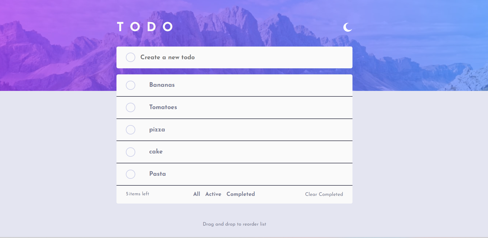
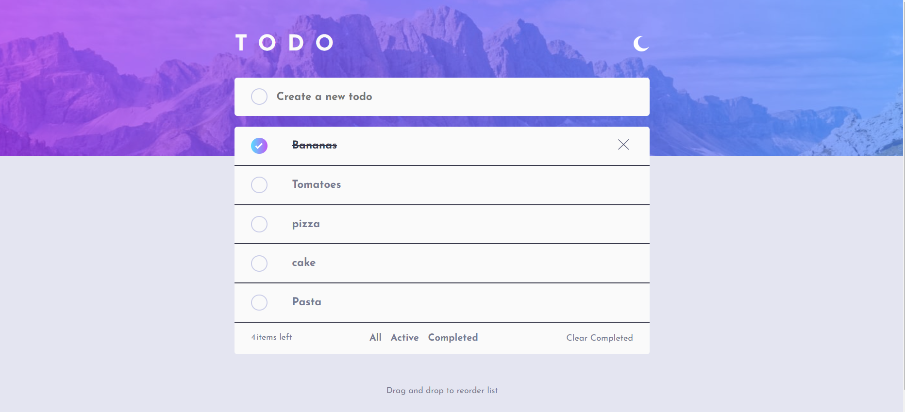
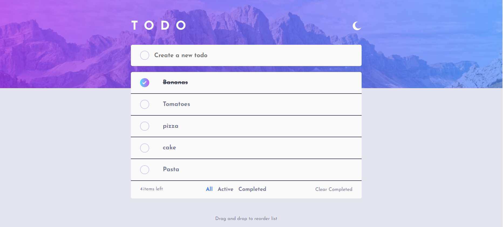
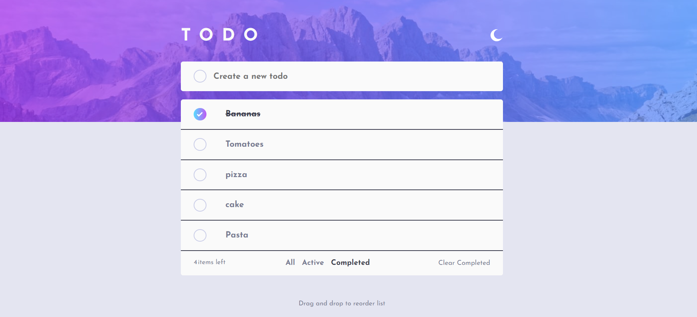
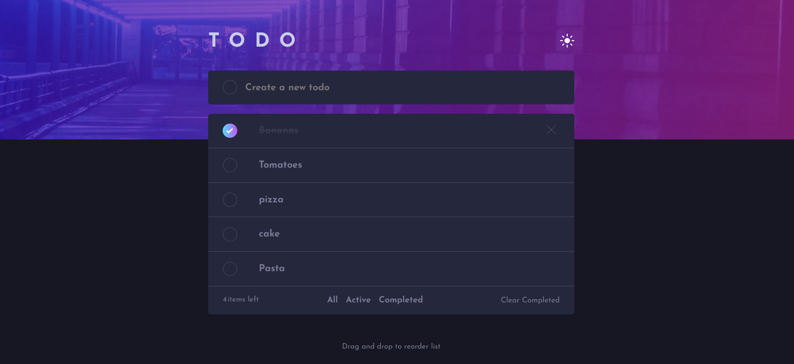
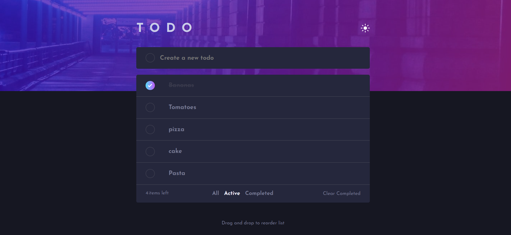
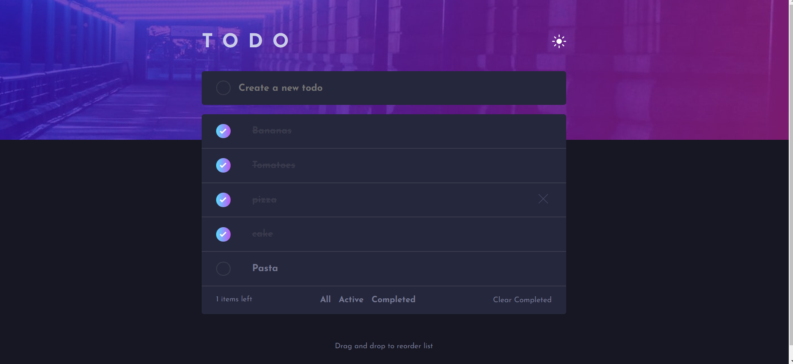

# Frontend Mentor - Todo app solution

This is a solution to the [Todo app challenge on Frontend Mentor](https://www.frontendmentor.io/challenges/todo-app-Su1_KokOW). Frontend Mentor challenges help you improve your coding skills by building realistic projects.

## Table of contents

- [Overview](#overview)
  - [The challenge](#the-challenge)
  - [Screenshot](#screenshot)
  - [Links](#links)
- [My process](#my-process)
  - [Built with](#built-with)
  - [What I learned](#what-i-learned)

**Note: Delete this note and update the table of contents based on what sections you keep.**

## Overview

### The challenge

Users should be able to:

- View the optimal layout for the app depending on their device's screen size
- See hover states for all interactive elements on the page
- Add new todos to the list
- Mark todos as complete
- Delete todos from the list
- Filter by all/active/complete todos
- Clear all completed todos
- Toggle light and dark mode
- **Bonus**: Drag and drop to reorder items on the list

### Screenshot

### Links

- Solution URL: [Add solution URL here](https://your-solution-url.com)
- Live Site URL: [Add live site URL here](https://your-live-site-url.com)

## My process

### Built with

## Built With

This project uses the following technologies and libraries:

- [React](https://reactjs.org/) - JavaScript library for building user interfaces.
- [Vite](https://vitejs.dev/) - Frontend build tool for fast development.
- [Styled-components](https://styled-components.com/) - CSS-in-JS library for styling components.
- [React Hook Form](https://react-hook-form.com/) - Library for managing forms in React.
- [Dnd-kit](https://dndkit.com/) - Modern drag-and-drop toolkit for React, including:
  - `@dnd-kit/core`
  - `@dnd-kit/sortable`
  - `@dnd-kit/utilities`
- [Nanoid](https://github.com/ai/nanoid) - A small, secure, URL-friendly unique string ID generator.
- [React Responsive](https://github.com/yocontra/react-responsive) - Media query library for React.
- [ESLint](https://eslint.org/) - JavaScript and JSX linting utility to ensure code quality.
- [Styled Components](https://styled-components.com/) - For styling your React components using tagged template literals.
- [Vite Plugin React](https://vitejs.dev/plugins/) - Enhances the development experience with React using Vite.

### What I learned

## What I Learned

During the development of this project, I learned about the following tools and concepts:

- **nanoid**: I explored how to use `nanoid` to generate unique, secure, and URL-friendly IDs for my to-do items. It provided a simple and efficient way to handle unique identifiers without the overhead of larger libraries.

- **dnd-kit**: I learned to implement drag-and-drop functionality using `dnd-kit`. It allowed me to create a dynamic and interactive user experience with sortable and draggable components, which greatly enhanced the usability of the app.
